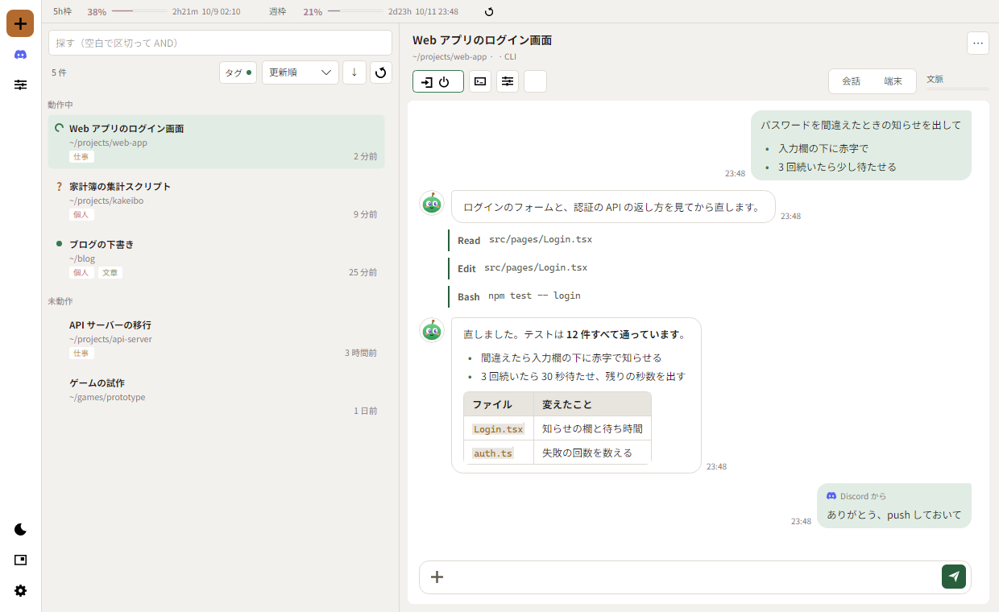

# NSClaudeCLI

**Claude Code のセッションを、ひとつの窓で回す。**

いくつも開いた Claude Code（CLI）を一覧にまとめ、どれが動いていて、どれが答えを待っているかをひと目で。
会話は読みやすく表示し、席を外しているあいだは Discord から続けられます。

[**ダウンロード**](../../releases/latest) · [入れ方](#入れ方) · [できること](#できること) · [よくある質問](#よくある質問)

<picture>
  <source media="(prefers-color-scheme: dark)" srcset="docs/screenshot-dark.png">
  
</picture>

画面の中身は見本です。

---

## できること

### 🗂 セッションを並べて見渡す
- 開いている Claude Code を「動作中」「未動作」に分けて一覧に
- 行の頭の印で状態が分かる — <kbd>●</kbd> 待ち／<kbd>↻</kbd> 対応中／<kbd>?</kbd> 答え待ち／<kbd>○</kbd> 起動準備中
- 名前・タグ・フォルダで探して、すぐ切り替え。過去のセッションも開き直せます

### 💬 会話を読みやすく
- Markdown（表・コード・箇条書き）をそのまま整えて表示。リンクも押せます
- 道具の呼び出し（Read / Edit / Bash など）は小さな札に
- 選択肢の問いや許可の確認は、ボタンで答えられます
- いつでも本物の端末に切り替え可能

### 🪟 並べて同時に見る
- 右の面を左右・上下に割って、いくつものセッションを並べて見られます（最大 4 枚）
- 一覧の行を枠へドラッグ。枠の端に落とせば、その側を割って新しい枠に出ます
- 割り方・枠の広さ・どの枠に何を出していたかを覚えていて、次に起動したときに同じ形で戻ります
- 窓の大きさと位置、最大化していたかも覚えています

### 📊 使用量をいつも上に
- 5 時間枠と週枠の使用量、リセットまでの時間を常に表示
- 小窓にすれば、ほかのアプリの手前に置いておけます。小窓では NSClaudeくんが状況を話してくれます

### 📱 Discord から続ける（任意）
- セッションごとに Discord のチャンネルへ橋渡し
- 返事が届き、問いにも答えられ、指示も送れます。外出先のスマホから続きを

### 🌙 省電力と自動の更新
- 省電力にすると描画だけを止め、セッションと Discord は動き続けます
- 新しい版が出ると知らせ、押すだけで入れ替え

---

## 入れ方

> [!IMPORTANT]
> 先に **[Claude Code](https://docs.anthropic.com/claude-code)**（`claude` コマンド、ログイン済み）と **[.NET 10 ランタイム](https://dotnet.microsoft.com/download/dotnet/10.0)** を入れてください。

### Windows

1. [最新版](../../releases/latest) から **`NSClaudeCLI-setup.exe`** を落として実行
2. 「Windows によって PC が保護されました」と出たら **「詳細情報」→「実行」**（署名していないためです）
3. スタートメニューの **NSClaudeCLI** から起動

管理者の権限は要りません。`%LOCALAPPDATA%\Programs\NSClaudeCLI` に入ります。
インストールせずに使いたい場合は `NSClaudeCLI.exe` 単体でも動きます。

### macOS

1. [最新版](../../releases/latest) から **`NSClaudeCLI-mac.zip`** を落として展開
2. **`NSClaudeCLI.app`** を「アプリケーション」へ移す
3. 初回だけ **右クリック →「開く」**（署名していないため、ダブルクリックでは止められます）

> [!NOTE]
> Mac 版は Intel（x64）向けです。Apple Silicon の Mac では Rosetta 2 と、x64 版の .NET ランタイムが要ります。

---

## 更新

起動時と 6 時間ごとに新しい版を確かめます。見つかると左下に <kbd>↓</kbd> のボタンが出て、押すとアプリを閉じて入れ替え、起こし直します。
**勝手に入れ替えることはありません。** 作業の切りのいいところで押してください。

## データの置き場所

設定や控えはアプリとは別の場所にあり、更新やアンインストールでは消えません。

| | |
|---|---|
| Windows | `%APPDATA%\ClaudeSessionManager` |
| macOS | `~/Library/Application Support/ClaudeSessionManager` |

> [!WARNING]
> Discord のトークンなどもここに保存されます。フォルダごと人に渡さないでください。

---

## よくある質問

<b>Claude Code の代わりになるものですか？</b>

いいえ。中で動いているのは、あなたの機械に入っている Claude Code そのものです。
NSClaudeCLI はそれを並べて見やすくする「外枠」です。使用量や料金の扱いも Claude Code と同じです。

<b>警告が出ますが、安全ですか？</b>

コード署名の証明書を持っていないため、Windows と macOS が「発行元が分からない」と警告します。
落とし先がこのリポジトリの Releases であることを確かめてから進めてください。

<b>消すには？</b>

- Windows：「設定」→「アプリ」→「NSClaudeCLI」→ アンインストール
- macOS：「アプリケーション」から `NSClaudeCLI.app` をゴミ箱へ

設定も消したいときは、上の「データの置き場所」のフォルダも消してください。

<b>ソースコードは？</b>

公開していません。このリポジトリは配布物（Releases）だけを置く場所です。

---

## おことわり

- **Anthropic の公式製品ではありません。** Anthropic とは関係のない、個人の開発物です。「Claude」「Claude Code」は Anthropic の商標です
- 自分たちで使うために作っているもので、**動作の保証やサポートはありません**。使うことで生じた問題について責任を負えません
- あくまで個人用のため、気付いたことをお知らせいただいても、反映できるとは限りません

同梱の書体 [Noto Sans JP](https://fonts.google.com/noto/specimen/Noto+Sans+JP) は SIL Open Font License 1.1 で配布されています。
